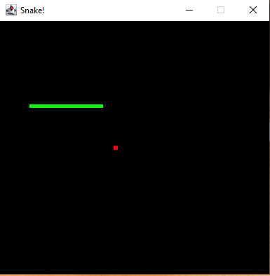

# Snake Game 🐍

Jogo **Snake** desenvolvido em **Java**, utilizando o **Java Module System (JPMS)** e uma arquitetura modular bem definida.

O projeto foi criado com foco em aprendizado, organização de código e boas práticas em Java moderno.

---

## 🎮 Screenshot do jogo



> Interface do jogo em execução.

---

## 🚀 Tecnologias utilizadas

- **Java 21**
- **JPMS (Java Platform Module System)**
- **java.desktop (AWT/Swing)**
- **Git & GitHub**

---

## ▶️ Como executar

1. Clone o repositório:
   ```bash
   git clone https://github.com/LuizFChagas/Snake-game-java.git
